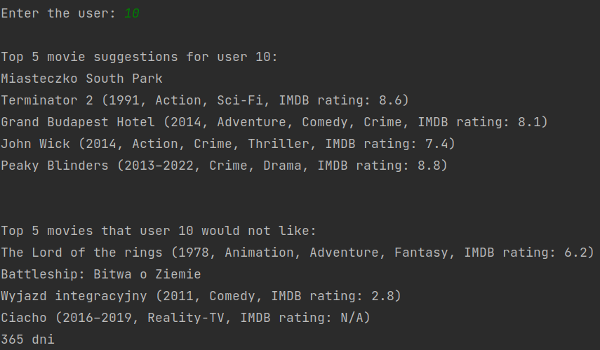
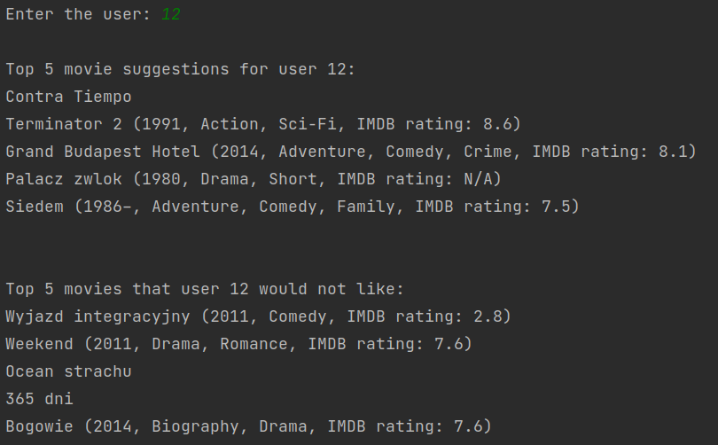
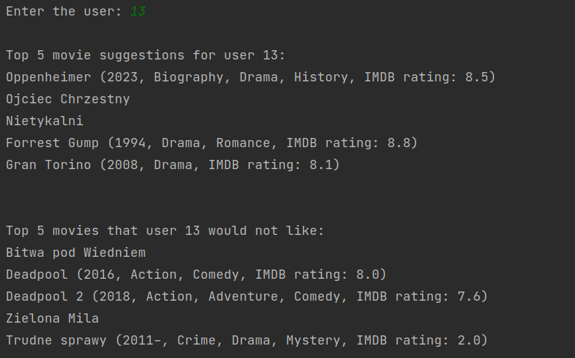

# Movie recommendation engine

## How to run

From repository-level, execute:

```
python3 -m venv venv
source /venv/bin/activate
pip3 install -r requirements.txt
```

To run, go to task folder and start:

```
cd Zjazd_3
python3 main.py
```

**Notice:** it uses external API with limits.

## Sample executions

Note: some movies has no details due to polish title in data instead of english.




