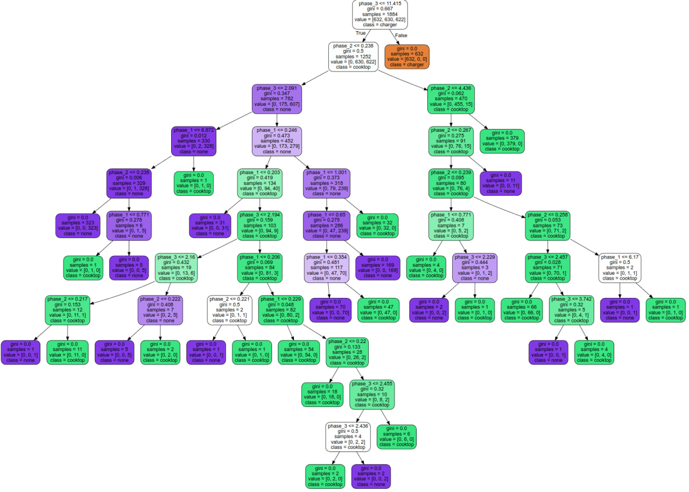

# Decision trees and SVM

## How to run

Each `.py` file in this folder has a comment on top with instructions.

### Project Structure

- `SVM-wine.py`- main script for training SVM classifier and evaluating wine quality
- `wine.py` - decision tree classifier for wine quality
- `energy.py` - decision tree classifier for second dataset - device recognition
- `data/` - directory with source CSV files

## Wine classification - tree

```
$ python3 wine.py

Wine classifier accuracy: 0.60

              precision    recall  f1-score   support

           3       0.00      0.00      0.00         2
           4       0.20      0.23      0.22        30
           5       0.62      0.65      0.64       274
           6       0.69      0.63      0.66       466
           7       0.52      0.58      0.55       166
           8       0.32      0.33      0.32        39
           9       0.00      0.00      0.00         3

    accuracy                           0.60       980
   macro avg       0.34      0.35      0.34       980
weighted avg       0.61      0.60      0.61       980
```

After running sample, you can preview [full tree visualisation](./wine_tree.svg)


## Device classification - tree

Dataset available at `./data/energy.csv` is created by author - rows were downloaded
from Home Assistant system (smart home) in author's home, from main 3-phase smart energy
meter that measures energy for whole building. 

Main goal is to detect which multiphase device is currently in use, only by meter readings.

There are three classes:
- `charger` - EV charger, capped to maximum available constant power
- `cooktop` - two-phase induction cook top, never used along charging
- `none` - no multiphase device detected

Sets are balanced - there is 785 rows for each class.

Statistics:
```
$ python3 energy.py 

Device classifier accuracy: 0.99

              precision    recall  f1-score   support

     charger       1.00      1.00      1.00       153
     cooktop       0.99      0.98      0.99       155
        none       0.98      0.99      0.99       163

    accuracy                           0.99       471
   macro avg       0.99      0.99      0.99       471
weighted avg       0.99      0.99      0.99       471
```

As previously, after running sample, you can preview [full tree visualisation](./energy_tree.svg)  
Here is sample one:




## Wine classification by SVM

```
SVM classifier accuracy: 0.81

              precision    recall  f1-score   support

           0       0.83      0.94      0.89       772
           1       0.59      0.30      0.40       208

    accuracy                           0.81       980
   macro avg       0.71      0.62      0.64       980
weighted avg       0.78      0.81      0.78       980

```

# Classification Report Metrics Explanation

In the classification report provided by Scikit-Learn, various metrics are displayed to help assess the quality of the classification model. Below are explanations for each parameter:

### Precision:

- Precision for a class is the number of correctly predicted positive cases divided by the total number of predicted positive cases (both true and false).
- **Formula:** Precision = TP / (TP + FP)
- **Where:**
    - TP (True Positives): Number of correctly predicted positive cases.
    - FP (False Positives): Number of falsely predicted positive cases.

### Recall:

- Recall for a class is the number of correctly predicted positive cases divided by the total number of actual positive cases.
- **Formula:** Recall = TP / (TP + FN)
- **Where:**
    - FN (False Negatives): Number of cases that were missed (falsely assigned to the negative class).

### F1-Score:

- Harmonic mean between precision and recall.
- **Formula:** F1-Score = 2 * (Precision * Recall) / (Precision + Recall)

### Support:

- The number of actual occurrences of a given class in the test set.

### Accuracy:

- Overall effectiveness of classification, i.e., the ratio of correctly classified samples to all samples.
- **Formula:** Accuracy = (TP + TN) / (TP + TN + FP + FN)
- **Where:**
    - TN (True Negatives): Number of correctly predicted negative cases.

### Macro Avg, Weighted Avg, Micro Avg:

- Averages for different classes, differences arise from different approaches to calculations for multiple classes.
