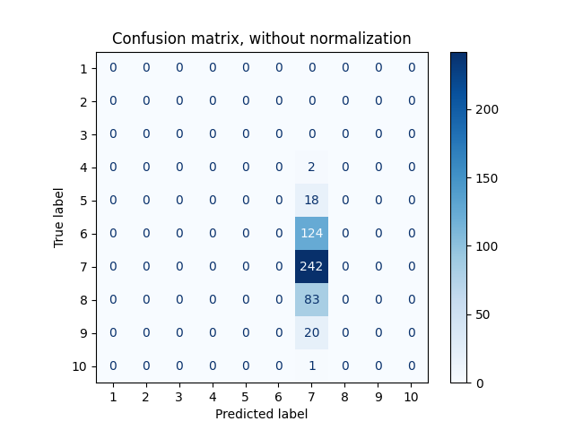
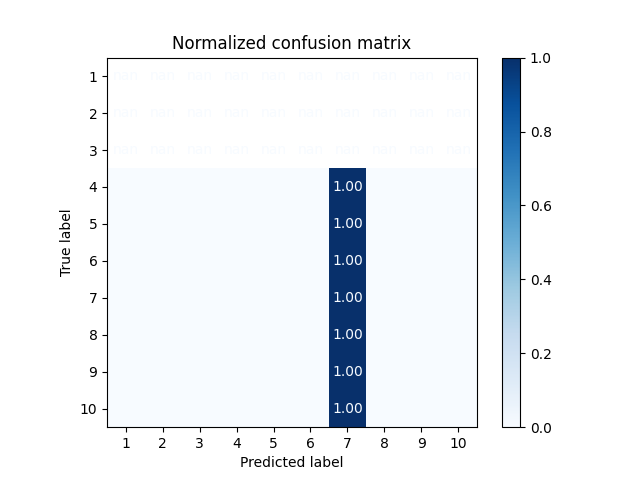
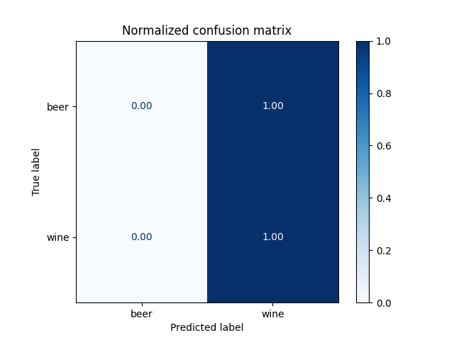
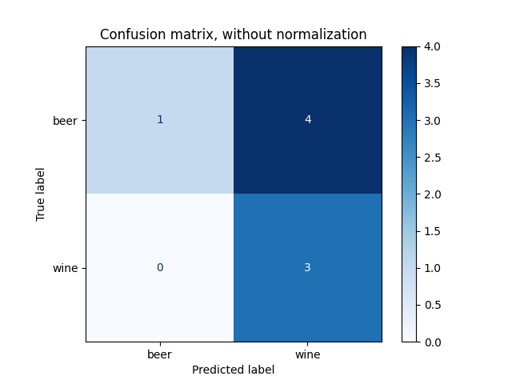
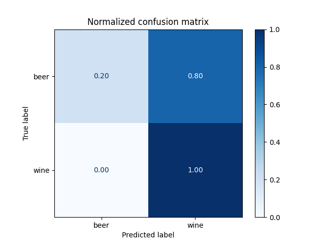

## How to run

Each `.py` file in this folder has a comment on top with instructions.

### Project Structure

- `wine.py` -  neural network classifier for wine quality
- `wineOrBeer.py` - neural network classifier for detect which product is wine or beer
- `wineOrBeer2model.py` - different neural network classifier for detect which product is wine or beer
- `data/` - directory with source CSV files
- `screenshot/` - directory with source picture files

## Wine classification - neural network 
```
$ python3 wine.py

Validation data loss: 0.217, categorical crossentropy: 1.389
Test data loss: 0.204, categorical crossentropy: 1.255

```




## Beer Wine classification - neural network - model 1
```
$ python3 wineOrBeer.py

Test accuracy: 0.375

```



## Beer Wine classification - neural network - model 2
```
$ python3 wineOrBeer2model.py

Test accuracy: 0.5

```



# Comparison

```
Number of Layers:

    Model 1: Three layers.
    Model 2: Two layers.

Number of Neurons:

    Model 1: First layer - 32 neurons, second layer - 16 neurons, third layer - 1 neuron.
    Model 2: First layer - 32 neurons, second layer - 1 neuron.

Activation Functions:

    Both models use the ReLU activation function in the first layer. The final layer in both models uses the sigmoid activation function, which is appropriate for binary classification problems.

```